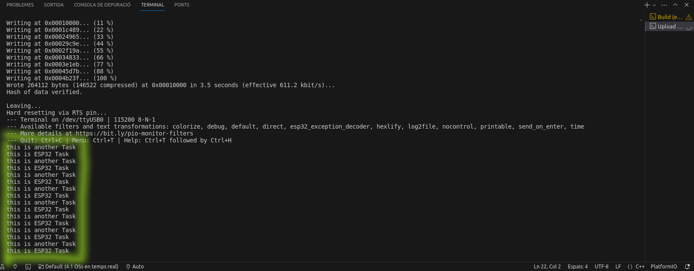

# PRACTICA 4: SISTEMES OPERATIUS EN TEMPS REAL
### Autor: Tomàs Lloret

L'objectiu d'aquesta pràctica és entendre el funcionament d'un sistema operatiu en temps real fent varies tasques i veient com s'executen dividint el temps d'ús de la CPU.

## Part A:
Iniciem el codi definint el pin al que hem connectat el LED i establint el seu mode en output. Creem una tasca en el setup amb la que primer tindrem el seu nom, la dinemsió de l'stack, el paràmetre, la prioritat i el seguiment de la tasca.
```c
#include <Arduino.h>

void anotherTask(void*parameter);

void setup(){
    Serial.begin(112500);
    xTaskCreate(anotherTask, "another Task", 10000, NULL, 1, NULL); 
}
```

Després, dins del loop creem una funció que va repetint "This is ESP32 Task" entre delays de un segon. També fem un altre void anomenat "AnotherTask" que farà un altre print a terminal dient "this is another Task" amb un altre delay d'un segon. 
```c
void loop(){
    Serial.println("this is ESP32 Task");
    delay(1000);
}

/* this function will be invoked when additionalTask was created */
void anotherTask( void * parameter ){
    /* loop forever */
    for(;;){
        Serial.println("this is another Task");
        delay(1000);
    }
}
```

### Part A: Codi complet
```c
#include <Arduino.h>

void anotherTask(void*parameter);

void setup(){
    Serial.begin(112500);
    xTaskCreate(anotherTask, "another Task", 10000, NULL, 1, NULL); 
}

void loop(){
    Serial.println("this is ESP32 Task");
    delay(1000);
}

/* this function will be invoked when additionalTask was created */
void anotherTask( void * parameter ){
    /* loop forever */
    for(;;){
        Serial.println("this is another Task");
        delay(1000);
    }
}
```

### Part A: Funcionament


En aquesta imatge veiem els prints fets pel loop.

## Part B:
Comencem utilitzant la funció "TaskHandle_t" per a declarar tres tasques, que encendran els LEDs, els apagaran i llegiran el valor del potenciòmetre respectivament.
```c
#include <Arduino.h>
TaskHandle_t Tasca1;
TaskHandle_t Tasca2;
TaskHandle_t Tasca3;
const double Ptr = 34;
const int led1 = 32;
const int led2 = 25;
```

Després comencem a escriure les dues primeres tasques, que s'iniciaran escrivint per terminal "La tasca N està corrent al core " indicant després amb la funció "xPortGetCoreID()" en quin core està assignada la funció. La tasca acabarà utilitzant un "digitalWrite(ledN, HIGH/LOW)" per a encendre o apagar el LED corresponent.
```c
void CodiTasca1(void*parameter){
  Serial.print("La tasca 1 està corrent al core ");
  Serial.println(xPortGetCoreID());

  for(;;){
    digitalWrite(led1, HIGH);
    vTaskDelay(500);
    digitalWrite(led1, LOW);
    vTaskDelay(500);
  } 
}

void CodiTasca2(void*parameter){
  Serial.print("La tasca 2 està corrent al core ");
  Serial.println(xPortGetCoreID());

  for(;;){
    digitalWrite(led2, HIGH);
    vTaskDelay(1000);
    digitalWrite(led2, LOW);
    vTaskDelay(1000);
  }
}
```

Aqui, com abans, iniciem escrivint per terminal "La tasca 3 està corrent al core " indicant després amb la funció "xPortGetCoreID()" en quin core està assignada la funció. Després, definim una variable double "test" per a llegir el valor analògic que ens dòna el potenciòmetre i impirmir-lo per pantalla.
```c
void CodiTasca3(void*parameter){
  Serial.print("La tasca 3 està corrent al core ");
  Serial.println(xPortGetCoreID());

  for(;;){
    double test = analogRead(Ptr);
    Serial.print("El valor del voltatge es ");
    Serial.println(test);
    vTaskDelay(1000);
  }
}
```

Finalment definim els pins als que estan connectats els LEDs i els establim en mode output, per a després crear les tasques corresponents, on posarem el nom, la mida de l'stack, el paràmetre. la prioritat i el seguiment de la tasca.
```c
void setup(){
  Serial.begin(115200); 
  pinMode(led1, OUTPUT);
  pinMode(led2, OUTPUT);

  xTaskCreatePinnedToCore(CodiTasca1,"Tasca1",10000,NULL,1,&Tasca1,0);                         
  vTaskDelay(500); 
  xTaskCreatePinnedToCore(CodiTasca2,"Tasca2",10000,NULL,1,&Tasca2,1);          
  vTaskDelay(500); 
  xTaskCreatePinnedToCore(CodiTasca3,"Tasca3",10000,NULL,1,&Tasca3,1);          
  vTaskDelay(5000); 
}
```

### Part B: Codi complet
```c
#include <Arduino.h>
TaskHandle_t Tasca1;
TaskHandle_t Tasca2;
TaskHandle_t Tasca3;
const double Ptr = 34;
const int led1 = 32;
const int led2 = 25;

void CodiTasca1(void*parameter){
  Serial.print("La tasca 1 està corrent al core ");
  Serial.println(xPortGetCoreID());

  for(;;){
    digitalWrite(led1, HIGH);
    vTaskDelay(500);
    digitalWrite(led1, LOW);
    vTaskDelay(500);
  } 
}

void CodiTasca2(void*parameter){
  Serial.print("La tasca 2 està corrent al core ");
  Serial.println(xPortGetCoreID());

  for(;;){
    digitalWrite(led2, HIGH);
    vTaskDelay(1000);
    digitalWrite(led2, LOW);
    vTaskDelay(1000);
  }
}

void CodiTasca3(void*parameter){
  Serial.print("La tasca 3 està corrent al core ");
  Serial.println(xPortGetCoreID());

  for(;;){
    double test = analogRead(Ptr);
    Serial.print("El valor del voltatge es ");
    Serial.println(test);
    vTaskDelay(1000);
  }
}

void setup(){
  Serial.begin(115200); 
  pinMode(led1, OUTPUT);
  pinMode(led2, OUTPUT);

  xTaskCreatePinnedToCore(CodiTasca1,"Tasca1",10000,NULL,1,&Tasca1,0);                         
  vTaskDelay(500); 
  xTaskCreatePinnedToCore(CodiTasca2,"Tasca2",10000,NULL,1,&Tasca2,1);          
  vTaskDelay(500); 
  xTaskCreatePinnedToCore(CodiTasca3,"Tasca3",10000,NULL,1,&Tasca3,1);          
  vTaskDelay(5000); 
}
```
